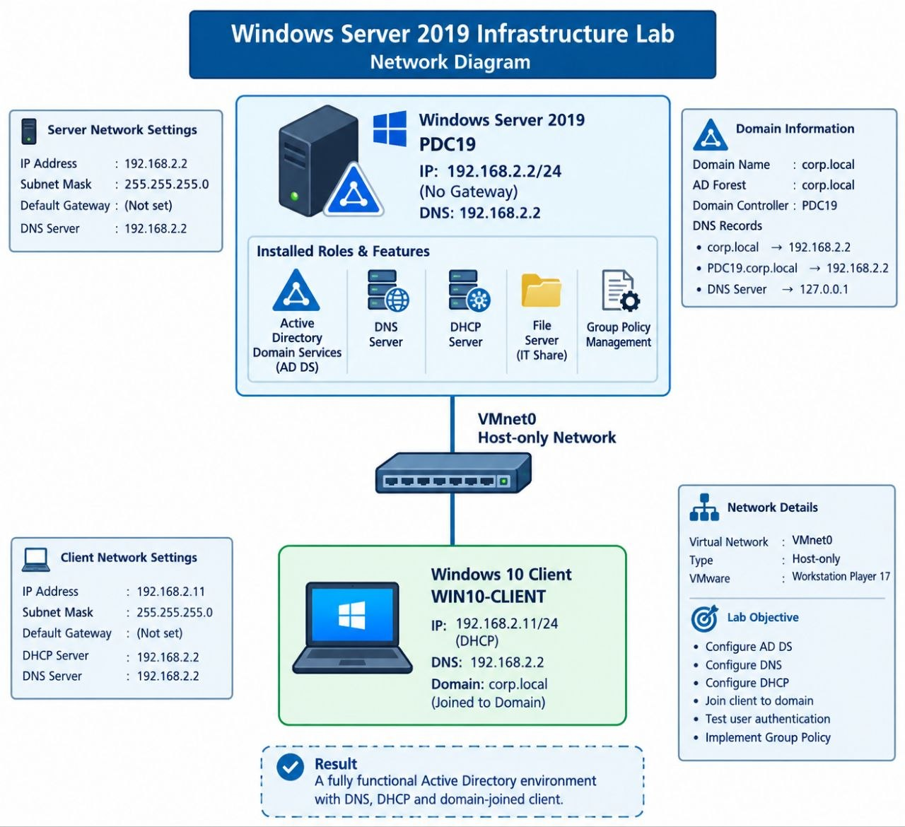

[09/09/2026 02:03 ص] Farag Raslan: Windows Server 2019 Infrastructure Lab
roject Overview# Windows Server 2019 Infrastructure Lab

## Project Overview

A practical Windows Server 2019 infrastructure lab designed to simulate a small enterprise IT environment.

The project includes Active Directory Domain Services, DNS, DHCP, Group Policy, File Server configuration, NTFS permissions, account lockout policies, Windows 10 domain joining, and troubleshooting scenarios.

## Lab Objectives

* Deploy Windows Server 2019
* Configure Active Directory Domain Services
* Create and organize Organizational Units
* Create users and security groups
* Configure DNS
* Configure DHCP
* Join a Windows 10 client to the domain
* Configure and verify Group Policy
* Configure a departmental File Server
* Apply NTFS permissions
* Configure account lockout security
* Test and troubleshoot common infrastructure problems

## Lab Architecture


| Device       | Operating System    | Role                             | IP Address          |
| ------------ | ------------------- | -------------------------------- | ------------------- |
| PDC19        | Windows Server 2019 | AD DS / DNS / DHCP / File Server | 192.168.2.2         |
| WIN10-CLIENT | Windows 10          | Domain Client                    | DHCP – 192.168.2.11 |

**Domain:** `corp.local`
**Network:** `192.168.2.0/24`
**VMware Network:** VMnet0 (Host-only)

## Technologies Used

* Windows Server 2019
* Windows 10
* Active Directory Domain Services
* DNS
* DHCP
* Group Policy
* NTFS Permissions
* VMware Workstation
* PowerShell
* Windows Administration

## Active Directory

Domain:

```text
corp.local
```

Organizational Units:

```text
IT
HR
Finance
Management
Company Users
```

Users were organized according to their departments and assigned appropriate security groups.

## DNS Configuration

DNS was configured on the domain controller.

Server IP:

```text
192.168.2.2
```

The following DNS tests were performed:

```text
nslookup corp.local
nslookup PDC19
```

Both successfully resolved to the domain controller.

## DHCP Configuration

DHCP was configured on Windows Server 2019.

Scope:

```text
Scope Name: Corp-LAN
Network: 192.168.2.0/24
Range: 192.168.2.11 - 192.168.2.240
DNS Server: 192.168.2.2
Domain: corp.local
```

The Windows 10 client successfully received its IP address from the Windows Server DHCP service.

## Windows 10 Domain Join

The Windows 10 client was joined successfully to:

```text
corp.local
```

A domain user was then used to log in:

```text
corp\ahmed.it
```

## Group Policy

Two main security policies were configured:

### Domain Password Policy

The domain password policy was configured to enforce stronger account security.

### Workstation Security Policy

The following setting was enabled:

```text
Interactive logon:
Do not display last signed-in
```

The policy was verified on the Windows 10 client using:

```text
gpresult /scope computer /r
```

## Account Lockout Policy

The account lockout policy was configured as follows:

```text
Account lockout threshold: 5 invalid attempts
Account lockout duration: 15 minutes
Reset account lockout counter: 15 minutes
```

The policy was tested by intentionally entering an incorrect password multiple times.

The test successfully locked the account.

The account was then unlocked using PowerShell:

```powershell
Unlock-ADAccount -Identity ahmed.it
```

## File Server

A shared company data structure was created:

```text
C:\CompanyData
│
├── IT
├── HR
├── Finance
└── Management
```

NTFS permissions were configured according to department membership.

Examples:

* IT administrators: Full Control
* IT users: Modify
* HR users: Modify
* Finance users: Modify
* Management users: Modify

Inheritance was disabled on the departmental folders to prevent unwanted permission inheritance.

## Permission Testing

File access was tested from the Windows 10 domain client.

The test verified that authorized users could access their department resources while unauthorized access was denied.

## Troubleshooting Scenarios

### DNS Failure

Troubleshooting included:

```text
ping 192.168.2.2
ipconfig /all
nslookup corp.local
nslookup PDC19
```

DNS service and DNS records were then checked.

### DHCP Failure

Troubleshooting included:

```text
ipconfig /all
ipconfig /release
ipconfig /renew
```

The DHCP scope, server service, VMware network configuration, and possible VMware DHCP conflicts were checked.

### Domain Login Failure

Troubleshooting included checking:

* Connectivity to the domain controller
* DNS configuration
* Domain membership
* Account status
* Account lockout
* Password
* Time synchronization
* Domain controller services

## Verification & Testing

The lab was verified through practical tests including:

* DNS name resolution
* DHCP address assignment
* Windows 10 domain join
* Group Policy application
* Account lockout
* Account unlock
* File and folder permissions
* Authorized and unauthorized file access
* Infrastructure troubleshooting

## Skills Demonstrated

* Windows Server Administration
* Active Directory Administration
* DNS Administration
* DHCP Administration
* Group Policy
* NTFS Permissions
* User and Group Management
* Domain Management
* PowerShell
* Network Troubleshooting
* Windows Client Administration
* IT Infrastructure Troubleshooting

## Project Outcome

This project demonstrates the deployment and administration of a small enterprise-style Windows infrastructure environment.

It provides practical experience in:

**Active Directory + DNS + DHCP + Group Policy + File Server + Security + Troubleshooting**

The project was built and tested in a VMware virtualized environment.

A practical Windows Server 2019 infrastructure lab designed to simulate a small enterprise IT environment.
The project includes Active Directory Domain Services, DNS, DHCP, Group Policy, File Server configuration, NTFS permissions, account lockout policies, Windows 10 domain joining, and troubleshooting scenarios.
Lab Objectives
Deploy Windows Server 2019
Configure Active Directory Domain Services
Create and organize Organizational Units
Create users and security groups
Configure DNS
Configure DHCP
Join a Windows 10 client to the domain
Configure and verify Group Policy
Configure a departmental File Server
Apply NTFS permissions
Configure account lockout security
Test and troubleshoot common infrastructure problems
Lab Architecture

Domain: corp.local
Network: 192.168.2.0/24
VMware Network: VMnet0 (Host-only)
Technologies Used
Windows Server 2019
Windows 10
Active Directory Domain Services
DNS
DHCP
Group Policy
NTFS Permissions
VMware Workstation
PowerShell
Windows Administration
Active Directory
Domain:
corp.local
Organizational Units:
IT
HR
Finance
Management
Company Users
Users were organized according to their departments and assigned appropriate security groups.
DNS Configuration
DNS was configured on the domain controller.
Server IP:
192.168.2.2
The following DNS tests were performed:
nslookup corp.local
nslookup PDC19
Both successfully resolved to the domain controller.
DHCP Configuration
DHCP was configured on Windows Server 2019.
Scope:
Scope Name: Corp-LAN
Network: 192.168.2.0/24
Range: 192.168.2.11 - 192.168.2.240
DNS Server: 192.168.2.2
Domain: corp.local
The Windows 10 client successfully received its IP address from the Windows Server DHCP service.
Windows 10 Domain Join
The Windows 10 client was joined successfully to:
corp.local
A domain user was then used to log in:
corp\ahmed.it
Group Policy
Two main security policies were configured:
Domain Password Policy
The domain password policy was configured to enforce stronger account security.
Workstation Security Policy
The following setting was enabled:
Interactive logon:
Do not display last signed-in
The policy was verified on the Windows 10 client using:
gpresult /scope computer /r
Account Lockout Policy
The account lockout policy was configured as follows:
Account lockout threshold: 5 invalid attempts
Account lockout duration: 15 minutes
Reset account lockout counter: 15 minutes
The policy was tested by intentionally entering an incorrect password multiple times.
The test successfully locked the account.
The account was then unlocked using PowerShell:
Unlock-ADAccount -Identity ahmed.it
File Server
A shared company data structure was created:
C:\CompanyData
│
├── IT
├── HR
├── Finance
└── Management
NTFS permissions were configured according to department membership.
Examples:
IT administrators: Full Control
IT users: Modify
HR users: Modify
Finance users: Modify
Management users: Modify
Inheritance was disabled on the departmental folders to prevent unwanted permission inheritance.
Permission Testing
File access was tested from the Windows 10 domain client.
The test verified that authorized users could access their department resources while unauthorized access was denied.
Troubleshooting Scenarios
DNS Failure
Troubleshooting included:
ping 192.168.2.2
ipconfig /all
nslookup corp.local
nslookup PDC19
DNS service and DNS records were then checked.
DHCP Failure
Troubleshooting included:
ipconfig /all
ipconfig /release
ipconfig /renew
The DHCP scope, server service, VMware network configuration, and possible VMware DHCP conflicts were checked.
Domain Login Failure
Troubleshooting included checking:
Connectivity to the domain controller
DNS configuration
Domain membership
Account status
Account lockout
Password
[09/09/2026 02:03 ص] Farag Raslan: Time synchronization
Domain controller services
Verification & Testing
The lab was verified through practical tests including:
DNS name resolution
DHCP address assignment
Windows 10 domain join
Group Policy application
Account lockout
Account unlock
File and folder permissions
Authorized and unauthorized file access
Infrastructure troubleshooting
Skills Demonstrated
Windows Server Administration
Active Directory Administration
DNS Administration
DHCP Administration
Group Policy
NTFS Permissions
User and Group Management
Domain Management
PowerShell
Network Troubleshooting
Windows Client Administration
IT Infrastructure Troubleshooting
Project Outcome
This project demonstrates the deployment and administration of a small enterprise-style Windows infrastructure environment.
It provides practical experience in:
Active Directory + DNS + DHCP + Group Policy + File Server + Security + Troubleshooting
The project was built and tested in a VMware virtualized environment.
